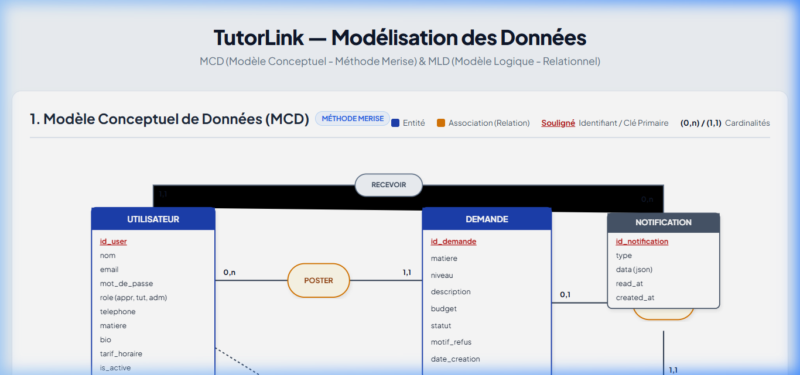

# 🎓 TutorLink — Plateforme de Tutorat Académique & Soutien Scolaire

<p align="center">
  
</p>

<p align="center">
  
  
  
  
  
  
</p>

---

## 📖 Sommaire

1. [Présentation du Projet](#-présentation-du-projet)
2. [Fonctionnalités Clés](#-fonctionnalités-clés)
3. [Architecture & Conception (MCD / MLD)](#-architecture--conception-mcd--mld)
4. [Prérequis Système](#-prérequis-système)
5. [Guide d'Installation Locale](#-guide-dinstallation-locale)
6. [Comptes de Démonstration](#-comptes-de-démonstration)
7. [Guide de Déploiement en Ligne](#-guide-de-déploiement-en-ligne)
8. [Checklist de Vérification en Production](#-checklist-de-vérification-en-production)
9. [Commandes Artisan Utiles](#-commandes-artisan-utiles)
10. [Structure du Projet](#-structure-du-projet)

---

## 🌟 Présentation du Projet

**TutorLink** est une application web moderne conçue pour révolutionner la mise en relation entre **élèves/étudiants** et **professeurs particuliers qualifiés** au Maroc.

La plateforme résout le manque de transparence et d'intermédiation sécurisée en proposant :
- Un système de **demandes ciblées** avec filtres par matière, niveau scolaire et budget.
- Un mécanisme de **modération préalable** par l'administrateur pour garantir la qualité des annonces.
- Un workflow de **candidatures chiffrées** soumises par les tuteurs.
- Un déblocage automatique des **coordonnées directes (WhatsApp & Téléphone)** dès qu'une offre est acceptée.
- Un système d'**évaluations et avis certifiés** garantissant la réputation des enseignants.

---

## 🚀 Fonctionnalités Clés

### 👨‍🎓 Espace Apprenant (Élève / Parent)
- **Publication de demandes** : Matière, niveau (Collège, Lycée, Supérieur...), description du besoin et budget en MAD.
- **Gestion des offres reçues** : Comparaison des profils de tuteurs, de leurs tarifs et messages de motivation.
- **Acceptation d'une offre** : Déblocage immédiat du lien direct WhatsApp et du numéro de téléphone du tuteur.
- **Évaluation post-cours** : Dépôt d'une note (1 à 5 étoiles) et d'un retour d'expérience constructif.

### 👨‍🏫 Espace Tuteur (Enseignant)
- **Consultation des demandes ouvertes** : Moteur de recherche avec filtres par matière, niveau et budget.
- **Soumission de propositions** : Proposition d'un tarif horaire et message personnalisé.
- **Profil académique valorisant** : Biographie détaillée, matières enseignées, tarif horaire indicatif et moyenne des avis.
- **Alertes en temps réel** : Notification dès qu'une offre est retenue par un apprenant.

### 🛡️ Espace Administrateur
- **Tableau de bord statistique (KPIs)** : Nombre d'utilisateurs, demandes en cours, taux de concrétisation.
- **Modération des annonces** : Validation ou refus (avec motif obligatoire) des demandes soumises.
- **Gestion des utilisateurs** : Activation / désactivation de comptes et consultation des profils.
- **Centre de notifications centralisé** : Alertes automatiques pour chaque nouvelle demande et offre acceptée.

---

## 📐 Architecture & Conception (MCD / MLD)

La base de données repose sur une modélisation formelle rigoureuse respectant la **méthode Merise** et le **modèle relationnel normalisé (3NF)**.

<p align="center">
  
</p>

*Les diagrammes haute résolution sont disponibles dans :*
- **MCD (Merise)** : [`public/images/MCD_TutorLink.png`](public/images/MCD_TutorLink.png)
- **MLD (Relationnel)** : [`public/images/MLD_TutorLink.png`](public/images/MLD_TutorLink.png)
- **Visualiseur interactif plein écran** : [`public/diagrams/mcd_mld.html`](public/diagrams/mcd_mld.html)

### Modèle Relationnel (MLD) :
```sql
USERS (id, name, email, password, role, telephone, matiere, bio, tarif_horaire, is_active, created_at, updated_at);
DEMANDES (id, #apprenant_id, matiere, niveau, description, budget, statut, motif_refus, created_at, updated_at);
OFFRES (id, #demande_id, #tuteur_id, message, tarif_propose, statut, coordonnees_visibles, created_at, updated_at);
AVIS (id, #demande_id, #apprenant_id, #tuteur_id, note, commentaire, created_at, updated_at);
COMMENTAIRES (id, #demande_id, #user_id, #offre_id, contenu, created_at, updated_at);
NOTIFICATIONS (id, type, notifiable_type, #notifiable_id, data, read_at, created_at, updated_at);
```

---

## 💻 Prérequis Système

Avant de commencer l'installation, assurez-vous de disposer des éléments suivants :
- **PHP** : version **8.3** ou supérieure (avec extensions : `pdo_mysql`, `mbstring`, `openssl`, `curl`, `tokenizer`, `xml`, `bcmath`).
- **Composer** : version **2.x**.
- **Node.js** : version **18.x** ou **20.x** & **NPM**.
- **MySQL / MariaDB** : version **8.0+** (ou via XAMPP / WAMP / Docker).
- **Git**.

---

## 🛠️ Guide d'Installation Locale

Suivez ces étapes pour exécuter le projet sur votre machine locale :

### 1. Cloner le dépôt Git
```bash
git clone https://github.com/NADABOUTA/TutorLink.git
cd TutorLink
```

### 2. Installer les dépendances PHP (Composer)
```bash
composer install
```

### 3. Configurer l'environnement (`.env`)
Copiez le fichier d'exemple et générez la clé de sécurité de l'application :
```bash
cp .env.example .env
php artisan key:generate
```

### 4. Configurer la base de données
Ouvrez votre fichier `.env` et adaptez les identifiants de votre serveur MySQL local :
```dotenv
DB_CONNECTION=mysql
DB_HOST=127.0.0.1
DB_PORT=3306
DB_DATABASE=tutorlink
DB_USERNAME=root
DB_PASSWORD=
```
*(Assurez-vous d'avoir préalablement créé la base de données `tutorlink` dans phpMyAdmin ou via la commande MySQL : `CREATE DATABASE tutorlink CHARACTER SET utf8mb4 COLLATE utf8mb4_unicode_ci;`)*

### 5. Exécuter les migrations et le jeu d'essai (Seeders)
```bash
php artisan migrate --seed
```

### 6. Installer et compiler les assets frontend
```bash
npm install
npm run build
```
*(En phase de développement actif, utilisez `npm run dev` pour profiter du rechargement à chaud).*

### 7. Lancer le serveur local
```bash
php artisan serve
```
L'application est désormais accessible sur : **`http://127.0.0.1:8000`**

---

## 🔑 Comptes de Démonstration

Le seeder (`RoleSeeder.php`) initialise automatiquement 3 comptes avec des rôles distincts pour tester l'ensemble des cas d'usage :

| Rôle | Adresse Email | Mot de passe | Permissions |
| :--- | :--- | :--- | :--- |
| **Administrateur** | `admin@tutorlink.com` | `password` | Modération des annonces, gestion des utilisateurs, alertes globales |
| **Tuteur (Enseignant)** | `tuteur@test.com` | `password` | Recherche d'annonces, soumission d'offres, profil tuteur |
| **Apprenant (Élève)** | `apprenant@test.com` | `password` | Publication de demandes, acceptation d'offres, dépôt d'avis |

---

## 🌐 Guide de Déploiement en Ligne

Voici les 3 méthodes recommandées pour mettre **TutorLink** en ligne :

### Option A : Déploiement Cloud Moderne (Render / Railway / Laravel Cloud) *(Recommandé)*

1. **Connecter le dépôt GitHub** : Liez `https://github.com/NADABOUTA/TutorLink` à votre tableau de bord (Render ou Railway).
2. **Configurer les variables d'environnement** :
   ```dotenv
   APP_NAME=TutorLink
   APP_ENV=production
   APP_DEBUG=false
   APP_KEY=base64:... (votre clé générée)
   APP_URL=https://votre-domaine.com
   DB_CONNECTION=mysql
   DB_HOST=...
   DB_PORT=3306
   DB_DATABASE=...
   DB_USERNAME=...
   DB_PASSWORD=...
   SESSION_DRIVER=database
   CACHE_STORE=database
   ```
3. **Build Command** :
   ```bash
   composer install --no-dev --optimize-autoloader && npm install && npm run build
   ```
4. **Start Command** :
   ```bash
   php artisan migrate --force && php artisan config:cache && php artisan route:cache && php artisan view:cache && php artisan serve --host=0.0.0.0 --port=$PORT
   ```

---

### Option B : Déploiement sur un VPS Linux (Ubuntu 22.04 / 24.04 + Nginx)

1. **Mettre à jour le serveur et installer PHP 8.3 & MySQL** :
   ```bash
   sudo apt update && sudo apt upgrade -y
   sudo apt install -y nginx mysql-server php8.3-fpm php8.3-mysql php8.3-mbstring php8.3-xml php8.3-curl php8.3-bcmath unzip git
   ```
2. **Cloner le projet dans `/var/www/tutorlink`** :
   ```bash
   sudo git clone https://github.com/NADABOUTA/TutorLink.git /var/www/tutorlink
   cd /var/www/tutorlink
   composer install --no-dev --optimize-autoloader
   npm install && npm run build
   ```
3. **Permissions des dossiers de stockage** :
   ```bash
   sudo chown -R www-data:www-data /var/www/tutorlink/storage /var/www/tutorlink/bootstrap/cache
   sudo chmod -R 775 /var/www/tutorlink/storage /var/www/tutorlink/bootstrap/cache
   ```
4. **Configuration du virtual host Nginx (`/etc/nginx/sites-available/tutorlink`)** :
   ```nginx
   server {
       listen 80;
       server_name votredomaine.com;
       root /var/www/tutorlink/public;

       add_header X-Frame-Options "SAMEORIGIN";
       add_header X-Content-Type-Options "nosniff";

       index index.php;
       charset utf-8;

       location / {
           try_files $uri $uri/ /index.php?$query_string;
       }

       location ~ \.php$ {
           fastcgi_pass unix:/var/run/php/php8.3-fpm.sock;
           fastcgi_param SCRIPT_FILENAME $realpath_root$fastcgi_script_name;
           include fastcgi_params;
       }

       location ~ /\.(?!well-known).* {
           deny all;
       }
   }
   ```
5. **Activer le site & certificat SSL gratuit (Certbot Let's Encrypt)** :
   ```bash
   sudo ln -s /etc/nginx/sites-available/tutorlink /etc/nginx/sites-enabled/
   sudo nginx -t && sudo systemctl reload nginx
   sudo apt install -y certbot python3-certbot-nginx
   sudo certbot --nginx -d votredomaine.com
   ```

---

### Option C : Hébergement Mutualisé (cPanel / Hostinger)

1. Transférez le contenu du projet dans la racine hors du webroot (ex: `/home/user/tutorlink`).
2. Déplacez le contenu du dossier `public/` à l'intérieur du dossier `public_html/`.
3. Éditez `public_html/index.php` pour pointer vers le bon chemin de l'autoloader :
   ```php
   require __DIR__.'/../tutorlink/vendor/autoload.php';
   $app = require_once __DIR__.'/../tutorlink/bootstrap/app.php';
   ```
4. Créez la base de données via l'assistant MySQL cPanel et importez le schéma SQL ou lancez `php artisan migrate --seed` via le terminal SSH.

---

## ✅ Checklist de Vérification en Production

Avant de valider la mise en ligne pour votre soutenance ou vos utilisateurs :

- [ ] **Environnement Sécurisé** : Vérifiez que `APP_ENV=production` et impérativement `APP_DEBUG=false` dans votre `.env`.
- [ ] **Clé d'Application** : `APP_KEY` doit être défini et non vide.
- [ ] **HTTPS / SSL** : Le cadenas vert est actif sur toutes les pages (`https://`).
- [ ] **Assets Vite** : `npm run build` a bien généré le dossier `public/build/` sans erreurs.
- [ ] **Caches Laravel activés** :
  ```bash
  php artisan config:cache
  php artisan route:cache
  php artisan view:cache
  ```
- [ ] **Test du parcours complet (Smoke Test)** :
  1. Connexion en tant qu'apprenant (`apprenant@test.com`) et publication d'une nouvelle demande.
  2. Connexion en tant qu'administrateur (`admin@tutorlink.com`), réception de la notification et approbation de la demande.
  3. Connexion en tant que tuteur (`tuteur@test.com`) et soumission d'une offre tarifaire.
  4. Reconnexion en tant qu'apprenant, acceptation de l'offre et vérification de l'affichage du lien WhatsApp direct.
  5. Dépôt d'un avis noté sur 5 étoiles pour le tuteur.

---

## ⚡ Commandes Artisan Utiles

| Commande | Utilité |
| :--- | :--- |
| `php artisan route:list` | Lister l'intégralité des routes enregistrées |
| `php artisan migrate:status` | Vérifier l'état d'exécution des migrations |
| `php artisan db:seed --class=RoleSeeder` | Réinitialiser les utilisateurs de test |
| `php artisan optimize:clear` | Vider tous les caches (config, routes, vues) |
| `vendor/bin/pint --format agent` | Formater le code PHP selon les standards PSR-12 / Laravel |
| `php artisan test` | Exécuter la suite de tests automatisés |

---

## 📁 Structure du Projet

```text
TutorLink/
├── app/
│   ├── Http/
│   │   ├── Controllers/       # Logique métier (Demande, Offre, Avis, Admin...)
│   │   ├── Middleware/        # Contrôle d'accès et vérification des rôles
│   │   └── Requests/          # Validation sécurisée des formulaires
│   ├── Models/                # Entités Eloquent (User, Demande, Offre, Avis)
│   ├── Notifications/         # Alertes database (NouvelleDemande, OffreAcceptee)
│   └── Policies/              # Règles d'autorisation fines (DemandePolicy)
├── database/
│   ├── migrations/            # Schémas et tables de la base de données
│   └── seeders/               # Données de test et comptes par défaut
├── public/
│   ├── build/                 # Bundles CSS et JS compilés par Vite
│   ├── diagrams/              # Visualiseur interactif MCD/MLD
│   └── images/                # Images et diagrammes exportés
├── resources/
│   ├── css/                   # Design system et tokens Tailwind personnalisés
│   └── views/                 # Interfaces Blade (Admin, Demandes, Offres...)
├── routes/
│   ├── web.php                # Routes web protégées par rôles et middleware auth
│   └── auth.php               # Routes d'authentification Laravel Breeze
└── tests/                     # Tests unitaires et fonctionnels (PHPUnit)
```

---

## 👥 Auteur & Remerciements

Projet conçu et développé par **NADA BOUTA** dans le cadre du projet académique **TutorLink**.  
Technologies : **Laravel 12**, **Tailwind CSS**, **MySQL**, **Merise**.

Pour toute suggestion ou question : [Dépôt GitHub](https://github.com/NADABOUTA/TutorLink)
